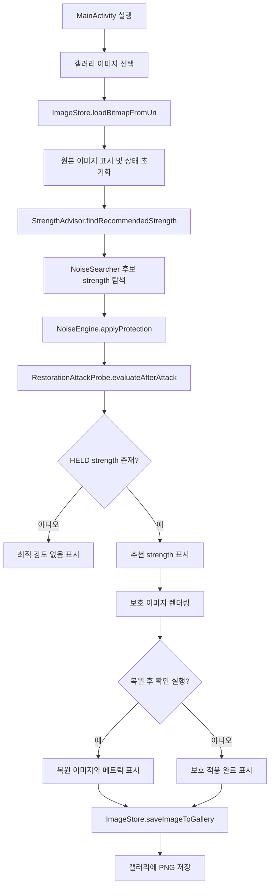
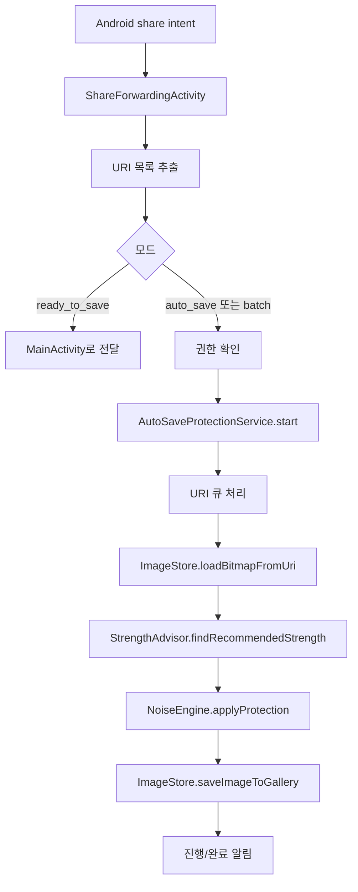
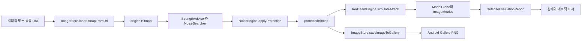
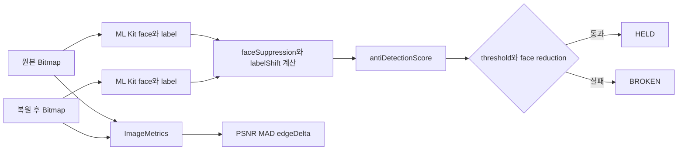
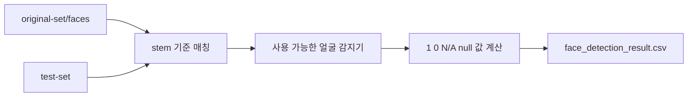
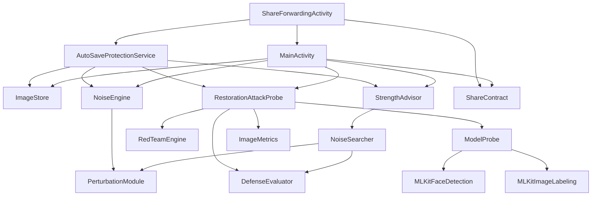

# ABSORB.md

## 1. 프로젝트 한 문장 요약

Haan Ghil Muulnaat는 Android에서 인물 사진을 불러와 edge-aware perturbation을 적용하고, 로컬 복원 시뮬레이션 뒤에도 얼굴 감지 억제가 유지되는지 확인한 다음 보호 이미지를 갤러리에 저장하는 앱이다.

## 2. 프로젝트가 해결하려는 문제

인물 사진은 공유되거나 저장된 뒤 얼굴 감지 모델, 이미지 라벨링 모델, 복원/업스케일링 처리에 다시 노출될 수 있다. 이 프로젝트는 사용자가 기기 안에서 이미지에 보호용 perturbation을 적용하고, 복원 시도 이후 얼굴 인식 신호가 얼마나 억제되는지 확인하도록 돕는다.

코드에서 확인되는 문제 정의는 다음과 같다.

- [`NoiseEngine`](app/src/main/java/com/haanghil/muulnaat/NoiseEngine.kt)은 원본 이미지에 strength 기반 노이즈를 적용한다.
- [`RedTeamEngine`](app/src/main/java/com/haanghil/muulnaat/RedTeamEngine.kt)은 보호 이미지에 denoising과 sharpening 성격의 복원 시뮬레이션을 적용한다.
- [`ModelProbe`](app/src/main/java/com/haanghil/muulnaat/ModelProbe.kt)는 ML Kit face detection과 image labeling 결과를 이용해 얼굴 억제와 라벨 변화량을 점수화한다.
- [`RestorationAttackProbe`](app/src/main/java/com/haanghil/muulnaat/RestorationAttackProbe.kt)는 복원 시뮬레이션 뒤 평가 결과를 [`HELD`](app/src/main/java/com/haanghil/muulnaat/PipelineContracts.kt) 또는 [`BROKEN`](app/src/main/java/com/haanghil/muulnaat/PipelineContracts.kt)으로 변환한다.

보안 보증이나 모든 모델에 대한 방어를 증명하는 코드는 확인되지 않았다. 그런 주장은 확인 필요다.

## 3. 전체 구조 요약

| 경로 | 역할 | 중요도 | 비고 |
| --- | --- | --- | --- |
| [`app/src/main/java/com/haanghil/muulnaat/MainActivity.kt`](app/src/main/java/com/haanghil/muulnaat/MainActivity.kt), [`MainActivityActions.kt`](app/src/main/java/com/haanghil/muulnaat/MainActivityActions.kt), [`MainActivityImageFlow.kt`](app/src/main/java/com/haanghil/muulnaat/MainActivityImageFlow.kt), [`MainActivityBatchFlow.kt`](app/src/main/java/com/haanghil/muulnaat/MainActivityBatchFlow.kt), [`MainActivityProtectionFlow.kt`](app/src/main/java/com/haanghil/muulnaat/MainActivityProtectionFlow.kt), [`MainActivityStorage.kt`](app/src/main/java/com/haanghil/muulnaat/MainActivityStorage.kt), [`MainActivityUi.kt`](app/src/main/java/com/haanghil/muulnaat/MainActivityUi.kt), [`MainActivityIntents.kt`](app/src/main/java/com/haanghil/muulnaat/MainActivityIntents.kt) | 메인 UI, 이미지 선택, 보호 적용, 평가 실행, 저장 흐름 제어 | High | 앱의 수동 사용 흐름을 역할별 파일로 분리 |
| [`app/src/main/java/com/haanghil/muulnaat/MainBindingAliases.kt`](app/src/main/java/com/haanghil/muulnaat/MainBindingAliases.kt) | 분리된 include layout의 ViewBinding 별칭 | Medium | Kotlin 호출부가 기존 `binding.*` 이름을 유지하도록 연결 |
| [`app/src/main/java/com/haanghil/muulnaat/AutoSaveProtectionService.kt`](app/src/main/java/com/haanghil/muulnaat/AutoSaveProtectionService.kt), [`AutoSaveWorker.kt`](app/src/main/java/com/haanghil/muulnaat/AutoSaveWorker.kt), [`AutoSaveNotifications.kt`](app/src/main/java/com/haanghil/muulnaat/AutoSaveNotifications.kt), [`AutoSaveIntentParsing.kt`](app/src/main/java/com/haanghil/muulnaat/AutoSaveIntentParsing.kt) | 공유 시트 기반 백그라운드 자동 보호/저장 처리 | High | service entry, worker, 알림, intent parsing을 분리 |
| [`app/src/main/java/com/haanghil/muulnaat/NoiseEngine.kt`](app/src/main/java/com/haanghil/muulnaat/NoiseEngine.kt) | edge-aware perturbation 생성 | High | [`PerturbationModule`](app/src/main/java/com/haanghil/muulnaat/PipelineContracts.kt) 구현 |
| [`app/src/main/java/com/haanghil/muulnaat/NoiseSearcher.kt`](app/src/main/java/com/haanghil/muulnaat/NoiseSearcher.kt) | strength 후보에서 최소 통과 강도 탐색 | High | 0..90 step 10 후보를 이분 탐색 |
| [`app/src/main/java/com/haanghil/muulnaat/StrengthAdvisor.kt`](app/src/main/java/com/haanghil/muulnaat/StrengthAdvisor.kt) | 권장 strength 탐색 래퍼와 UI 문구 생성 | Medium | [`NoiseSearcher`](app/src/main/java/com/haanghil/muulnaat/NoiseSearcher.kt)를 감싼 얇은 계층 |
| [`app/src/main/java/com/haanghil/muulnaat/ModelProbe.kt`](app/src/main/java/com/haanghil/muulnaat/ModelProbe.kt) | ML Kit 얼굴 감지/라벨링 결과를 점수화 | High | face suppression, label shift, anti-detection score |
| [`app/src/main/java/com/haanghil/muulnaat/RestorationAttackProbe.kt`](app/src/main/java/com/haanghil/muulnaat/RestorationAttackProbe.kt) | 복원 시뮬레이션 후 평가 리포트 생성 | High | [`DefenseEvaluator`](app/src/main/java/com/haanghil/muulnaat/PipelineContracts.kt) 구현 |
| [`app/src/main/java/com/haanghil/muulnaat/RedTeamEngine.kt`](app/src/main/java/com/haanghil/muulnaat/RedTeamEngine.kt) | denoising + sharpening 방식의 복원 시뮬레이션 | High | TFLite 모델 호출은 확인되지 않고 직접 필터 구현 |
| [`app/src/main/java/com/haanghil/muulnaat/ImageStore.kt`](app/src/main/java/com/haanghil/muulnaat/ImageStore.kt) | URI 이미지 로드, EXIF 회전 보정, PNG 갤러리 저장 | High | MediaStore 사용 |
| [`app/src/main/java/com/haanghil/muulnaat/PipelineContracts.kt`](app/src/main/java/com/haanghil/muulnaat/PipelineContracts.kt) | 상태, 메트릭, 리포트, 인터페이스 정의 | High | 모듈 간 계약 |
| [`app/src/main/java/com/haanghil/muulnaat/ShareForwardingActivity.kt`](app/src/main/java/com/haanghil/muulnaat/ShareForwardingActivity.kt) | Android share intent를 메인 화면 또는 자동 저장 서비스로 전달 | High | `SEND`, `SEND_MULTIPLE` 처리 |
| [`app/src/main/java/com/haanghil/muulnaat/ShareContract.kt`](app/src/main/java/com/haanghil/muulnaat/ShareContract.kt) | 공유/서비스 intent action, extra, mode 상수 | Medium | MainActivity, 서비스, forwarding activity가 공유 |
| [`app/src/main/res/layout/activity_main.xml`](app/src/main/res/layout/activity_main.xml), [`main_header_controls.xml`](app/src/main/res/layout/main_header_controls.xml), [`main_image_panels.xml`](app/src/main/res/layout/main_image_panels.xml), [`main_status_card.xml`](app/src/main/res/layout/main_status_card.xml), [`main_technical_details.xml`](app/src/main/res/layout/main_technical_details.xml), [`main_quality_metrics_card.xml`](app/src/main/res/layout/main_quality_metrics_card.xml) | 메인 화면 레이아웃 | High | header/actions, 이미지 패널, 상태 카드, 기술 지표를 include layout으로 분리 |
| [`app/src/main/res/values/strings.xml`](app/src/main/res/values/strings.xml), [`values-ko/strings.xml`](app/src/main/res/values-ko/strings.xml), [`values-fr/strings.xml`](app/src/main/res/values-fr/strings.xml), [`values-he/strings.xml`](app/src/main/res/values-he/strings.xml), [`values-ru/strings.xml`](app/src/main/res/values-ru/strings.xml) | 앱 표시 문자열 및 다국어 리소스 | Medium | 기본, 한국어, 프랑스어, 히브리어, 러시아어 |
| [`app/src/main/AndroidManifest.xml`](app/src/main/AndroidManifest.xml) | 권한, activity, service, ML Kit dependency 선언 | High | 런처와 공유 진입점 정의 |
| [`app/src/test/java/com/haanghil/muulnaat/NoiseSearcherTest.kt`](app/src/test/java/com/haanghil/muulnaat/NoiseSearcherTest.kt) | strength 탐색 로직 단위 테스트 | High | 후보 범위와 progress callback 검증 |
| [`app/src/test/java/com/haanghil/muulnaat/ModelProbeTest.kt`](app/src/test/java/com/haanghil/muulnaat/ModelProbeTest.kt) | 점수 계산 보조 함수 단위 테스트 | High | ML Kit 호출 자체는 테스트하지 않음 |
| [`app/build.gradle.kts`](app/build.gradle.kts) | Android 모듈 빌드 설정과 의존성 | High | ML Kit, TensorFlow Lite 의존성 포함 |
| [`build-android.ps1`](build-android.ps1) | Windows release APK 빌드 helper | Medium | signing env var 없으면 debug signing release |
| [`install-apk.ps1`](install-apk.ps1) | release APK를 연결 기기에 설치하는 helper | Medium | `local.properties`의 `sdk.dir` 필요 |
| [`.github/workflows/release.yml`](.github/workflows/release.yml) | 태그 push/workflow_dispatch 기반 APK 릴리스 | Medium | signing secrets 필요 |
| [`ipynbbbbb/face_detection_test_realtime.py`](ipynbbbbb/face_detection_test_realtime.py) | 로컬 얼굴 감지 실험 CSV 생성 스크립트 | Medium | 입력 데이터와 결과 CSV는 `.gitignore` 대상이라 내용 확인하지 않음 |
| [`docs/site/index.html`](docs/site/index.html), [`script.js`](docs/site/script.js), [`styles.css`](docs/site/styles.css), [`translations.js`](docs/site/translations.js) | 보존용 정적 사이트 | Low | 앱 실행에는 직접 관여하지 않음 |
| [`README.md`](README.md), [`PRIVACY.md`](PRIVACY.md), [`LICENSE`](LICENSE) | 공개 문서와 라이선스 | Medium | 구조 이해의 보조 자료 |

## 4. 전체 실행 흐름

### 메인 화면 수동 흐름

1. 사용자가 [`MainActivity`](app/src/main/java/com/haanghil/muulnaat/MainActivity.kt)를 실행한다.
2. `ActivityResultContracts.PickVisualMedia`로 이미지를 선택한다.
3. [`ImageStore.loadBitmapFromUri()`](app/src/main/java/com/haanghil/muulnaat/ImageStore.kt)가 URI에서 비트맵을 읽고, 큰 이미지는 최대 변 기준 1280px 근처로 downsample하며, EXIF 방향을 보정한다.
4. [`prepareLoadedImage()`](app/src/main/java/com/haanghil/muulnaat/MainActivityImageFlow.kt)가 원본 이미지를 화면에 표시하고 이전 결과를 초기화한다.
5. [`startOptimalStrengthFlow()`](app/src/main/java/com/haanghil/muulnaat/MainActivityImageFlow.kt)가 백그라운드 thread에서 [`StrengthAdvisor.findRecommendedStrength()`](app/src/main/java/com/haanghil/muulnaat/StrengthAdvisor.kt)를 호출한다.
6. [`NoiseSearcher.findMinimumStrength()`](app/src/main/java/com/haanghil/muulnaat/NoiseSearcher.kt)가 strength 후보를 검사한다.
7. 각 후보마다 [`NoiseEngine.applyProtection()`](app/src/main/java/com/haanghil/muulnaat/NoiseEngine.kt)으로 보호 이미지를 만들고 [`RestorationAttackProbe.evaluateAfterAttack()`](app/src/main/java/com/haanghil/muulnaat/RestorationAttackProbe.kt)으로 복원 후 평가한다.
8. 최소 [`HELD`](app/src/main/java/com/haanghil/muulnaat/PipelineContracts.kt) strength가 있으면 UI에 추천값을 표시하고, auto recovery 설정에 따라 보호 적용과 평가를 이어서 실행한다.
9. 사용자가 저장 버튼을 누르면 [`ImageStore.saveImageToGallery()`](app/src/main/java/com/haanghil/muulnaat/ImageStore.kt)가 PNG를 MediaStore에 저장한다.



### 공유 시트 자동 저장 흐름

1. 다른 앱에서 이미지를 공유하면 [`ShareReadyToSaveActivity`](app/src/main/java/com/haanghil/muulnaat/ShareForwardingActivity.kt) 또는 [`ShareAutoSaveActivity`](app/src/main/java/com/haanghil/muulnaat/ShareForwardingActivity.kt)가 받는다.
2. [`ShareForwardingActivity.forwardShare()`](app/src/main/java/com/haanghil/muulnaat/ShareForwardingActivity.kt)가 URI 목록을 만든다.
3. 단일 ready-to-save는 [`MainActivity`](app/src/main/java/com/haanghil/muulnaat/MainActivity.kt)로 넘긴다.
4. auto-save 또는 다중 이미지는 권한 확인 후 [`AutoSaveProtectionService.start()`](app/src/main/java/com/haanghil/muulnaat/AutoSaveProtectionService.kt)로 foreground service를 시작한다.
5. 서비스는 큐에 URI를 넣고 worker thread에서 이미지별로 로드, 최소 strength 탐색, 보호 적용, 저장을 반복한다.
6. 알림으로 진행 상황을 표시하고 cancel action을 처리한다.



## 5. 핵심 기능별 구조

### 이미지 입력과 로드

* 목적: 갤러리 또는 공유 시트에서 들어온 이미지 URI를 앱 내부 `Bitmap`으로 변환한다.
* 관련 파일: [`MainActivity.kt`](app/src/main/java/com/haanghil/muulnaat/MainActivity.kt), [`MainActivityImageFlow.kt`](app/src/main/java/com/haanghil/muulnaat/MainActivityImageFlow.kt), [`MainActivityIntents.kt`](app/src/main/java/com/haanghil/muulnaat/MainActivityIntents.kt), [`ShareForwardingActivity.kt`](app/src/main/java/com/haanghil/muulnaat/ShareForwardingActivity.kt), [`ImageStore.kt`](app/src/main/java/com/haanghil/muulnaat/ImageStore.kt), [`AndroidManifest.xml`](app/src/main/AndroidManifest.xml)
* 주요 함수 또는 클래스: [`pickImageLauncher`](app/src/main/java/com/haanghil/muulnaat/MainActivity.kt), [`processSingleImageUri`](app/src/main/java/com/haanghil/muulnaat/MainActivityImageFlow.kt), [`ShareForwardingActivity.forwardShare`](app/src/main/java/com/haanghil/muulnaat/ShareForwardingActivity.kt), [`ImageStore.loadBitmapFromUri`](app/src/main/java/com/haanghil/muulnaat/ImageStore.kt)
* 입력: Android Photo Picker 결과 URI, `Intent.EXTRA_STREAM`, `ClipData`
* 처리: URI 목록 추출, 권한 부여 flag/clipData 전달, bitmap bounds 확인, `inSampleSize` downsample, `ARGB_8888` decode, EXIF 방향 보정
* 출력: [`originalBitmap`](app/src/main/java/com/haanghil/muulnaat/MainActivity.kt), [`binding.originalImage`](app/src/main/java/com/haanghil/muulnaat/MainBindingAliases.kt)에 표시된 원본 이미지
* 예외 또는 주의점: 이미지 읽기 실패 시 `null`을 반환하고 UI에는 load failed 문구를 표시한다. 최대 변 1280px보다 큰 이미지는 downsample된다.
* 내가 면접에서 설명해야 할 핵심: “입력은 파일 경로가 아니라 Android URI로 받고, ContentResolver 기반으로 안전하게 읽으며 EXIF 회전까지 보정했다.”

### 보호 이미지 생성

* 목적: 원본 이미지에 strength 기반 perturbation을 적용해 보호 이미지를 만든다.
* 관련 파일: [`NoiseEngine.kt`](app/src/main/java/com/haanghil/muulnaat/NoiseEngine.kt), [`PipelineContracts.kt`](app/src/main/java/com/haanghil/muulnaat/PipelineContracts.kt), [`MainActivityProtectionFlow.kt`](app/src/main/java/com/haanghil/muulnaat/MainActivityProtectionFlow.kt), [`AutoSaveWorker.kt`](app/src/main/java/com/haanghil/muulnaat/AutoSaveWorker.kt)
* 주요 함수 또는 클래스: [`NoiseEngine.applyProtection`](app/src/main/java/com/haanghil/muulnaat/NoiseEngine.kt), [`NoiseEngine.protect`](app/src/main/java/com/haanghil/muulnaat/NoiseEngine.kt), [`PerturbationModule`](app/src/main/java/com/haanghil/muulnaat/PipelineContracts.kt)
* 입력: `Bitmap source`, `Int strength`
* 처리: strength를 0..100으로 제한하고, luma 기반 edge map을 만든 뒤 edge가 강한 곳에 더 큰 amplitude의 xorshift 기반 채널별 노이즈를 적용한다.
* 출력: 새 `Bitmap` 보호 이미지
* 예외 또는 주의점: 모든 픽셀을 순회하므로 이미지 크기에 비례해 비용이 든다. 원본 alpha는 보존하지 않고 출력 alpha를 `0xFF`로 설정한다.
* 내가 면접에서 설명해야 할 핵심: “무작위 노이즈를 전역적으로 뿌리는 것이 아니라, edge map을 만들어 고주파 영역에 더 강하게 적용하도록 구현했다.”

### 최소 strength 탐색

* 목적: 복원 후에도 방어 상태가 유지되는 최소 perturbation strength를 찾는다.
* 관련 파일: [`NoiseSearcher.kt`](app/src/main/java/com/haanghil/muulnaat/NoiseSearcher.kt), [`StrengthAdvisor.kt`](app/src/main/java/com/haanghil/muulnaat/StrengthAdvisor.kt), [`MainActivityImageFlow.kt`](app/src/main/java/com/haanghil/muulnaat/MainActivityImageFlow.kt), [`MainActivityBatchFlow.kt`](app/src/main/java/com/haanghil/muulnaat/MainActivityBatchFlow.kt), [`AutoSaveWorker.kt`](app/src/main/java/com/haanghil/muulnaat/AutoSaveWorker.kt)
* 주요 함수 또는 클래스: [`NoiseSearcher.findMinimumStrength`](app/src/main/java/com/haanghil/muulnaat/NoiseSearcher.kt), [`StrengthAdvisor.findRecommendedStrength`](app/src/main/java/com/haanghil/muulnaat/StrengthAdvisor.kt), [`NoiseSearcher.SearchStep`](app/src/main/java/com/haanghil/muulnaat/NoiseSearcher.kt)
* 입력: 원본 bitmap, perturbation module, defense evaluator, optional `onStep`, optional `shouldCancel`
* 처리: 기본 후보 `0, 10, ..., 90` 중 마지막 후보가 실패하면 `null`을 반환하고, 통과 가능성이 있으면 후보 배열 위에서 이분 탐색한다.
* 출력: 최소 통과 strength 또는 `null`
* 예외 또는 주의점: 후보는 10 단위라 실제 최소값이 아니라 후보 집합 안의 최소값이다. `hi=100`이어도 기본 후보의 최댓값은 90이다.
* 내가 면접에서 설명해야 할 핵심: “101개 strength 전체를 모두 평가하지 않고 10단위 후보와 이분 탐색으로 평가 횟수를 줄였다. 단, 정확도는 후보 granularity에 묶인다.”

### 복원 후 방어 평가

* 목적: 보호 이미지가 denoising/sharpening 성격의 복원 시뮬레이션 뒤에도 얼굴 감지 억제를 유지하는지 판단한다.
* 관련 파일: [`RestorationAttackProbe.kt`](app/src/main/java/com/haanghil/muulnaat/RestorationAttackProbe.kt), [`RedTeamEngine.kt`](app/src/main/java/com/haanghil/muulnaat/RedTeamEngine.kt), [`ModelProbe.kt`](app/src/main/java/com/haanghil/muulnaat/ModelProbe.kt), [`ImageMetrics.kt`](app/src/main/java/com/haanghil/muulnaat/ImageMetrics.kt), [`PipelineContracts.kt`](app/src/main/java/com/haanghil/muulnaat/PipelineContracts.kt)
* 주요 함수 또는 클래스: [`RestorationAttackProbe.evaluateAfterAttack`](app/src/main/java/com/haanghil/muulnaat/RestorationAttackProbe.kt), [`RedTeamEngine.simulateAttack`](app/src/main/java/com/haanghil/muulnaat/RedTeamEngine.kt), [`ModelProbe.evaluate`](app/src/main/java/com/haanghil/muulnaat/ModelProbe.kt), [`ImageMetrics.evaluate`](app/src/main/java/com/haanghil/muulnaat/ImageMetrics.kt)
* 입력: 원본 bitmap, 보호 bitmap
* 처리: [`RedTeamEngine`](app/src/main/java/com/haanghil/muulnaat/RedTeamEngine.kt)으로 복원 시뮬레이션 bitmap을 만들고, [`ModelProbe`](app/src/main/java/com/haanghil/muulnaat/ModelProbe.kt)로 ML Kit 얼굴/라벨 결과를 점수화하며, [`ImageMetrics`](app/src/main/java/com/haanghil/muulnaat/ImageMetrics.kt)로 PSNR/MAD/edge delta를 계산한다.
* 출력: [`DefenseEvaluationReport`](app/src/main/java/com/haanghil/muulnaat/PipelineContracts.kt)와 [`ProtectionStatus.HELD`](app/src/main/java/com/haanghil/muulnaat/PipelineContracts.kt) 또는 [`ProtectionStatus.BROKEN`](app/src/main/java/com/haanghil/muulnaat/PipelineContracts.kt)
* 예외 또는 주의점: [`ModelProbe.evaluate()`](app/src/main/java/com/haanghil/muulnaat/ModelProbe.kt)는 `Tasks.await()`를 사용하므로 UI thread에서 직접 호출하면 안 된다. [`MainActivityImageFlow`](app/src/main/java/com/haanghil/muulnaat/MainActivityImageFlow.kt), [`MainActivityProtectionFlow`](app/src/main/java/com/haanghil/muulnaat/MainActivityProtectionFlow.kt), [`AutoSaveWorker`](app/src/main/java/com/haanghil/muulnaat/AutoSaveWorker.kt)는 thread 안에서 호출한다.
* 내가 면접에서 설명해야 할 핵심: “방어 평가는 보호 직후가 아니라 복원 시뮬레이션 이후의 얼굴/라벨 신호를 기준으로 한다.”

### 결과 표시와 기술 세부 지표

* 목적: 보호 상태, 얼굴 수 변화, 라벨 변화량, anti-detection score, 품질 지표를 UI에 표시한다.
* 관련 파일: [`MainActivityUi.kt`](app/src/main/java/com/haanghil/muulnaat/MainActivityUi.kt), [`activity_main.xml`](app/src/main/res/layout/activity_main.xml), [`main_image_panels.xml`](app/src/main/res/layout/main_image_panels.xml), [`main_status_card.xml`](app/src/main/res/layout/main_status_card.xml), [`main_technical_details.xml`](app/src/main/res/layout/main_technical_details.xml), [`strings.xml`](app/src/main/res/values/strings.xml)
* 주요 함수 또는 클래스: [`renderDefenseResult`](app/src/main/java/com/haanghil/muulnaat/MainActivityUi.kt), [`renderProtectedImage`](app/src/main/java/com/haanghil/muulnaat/MainActivityUi.kt), [`renderRecoveredImage`](app/src/main/java/com/haanghil/muulnaat/MainActivityUi.kt), [`setTechnicalDetailsVisible`](app/src/main/java/com/haanghil/muulnaat/MainActivityUi.kt)
* 입력: [`DefenseEvaluationReport`](app/src/main/java/com/haanghil/muulnaat/PipelineContracts.kt), 원본/보호/복원 bitmap
* 처리: 이미지 3패널을 갱신하고, PSNR을 8..50 dB 범위로 0..100% 표시값으로 변환한다.
* 출력: 화면의 status card, model metrics, quality metrics, perturbation magnitude
* 예외 또는 주의점: 기술 세부 지표 컨테이너는 기본 숨김 상태다.
* 내가 면접에서 설명해야 할 핵심: “사용자에게는 PASS/HELD/BROKEN을 보여주고, 필요하면 세부 점수와 품질 지표를 열어볼 수 있게 했다.”

### 갤러리 저장

* 목적: 보호된 이미지를 Android 갤러리에 PNG로 저장한다.
* 관련 파일: [`ImageStore.kt`](app/src/main/java/com/haanghil/muulnaat/ImageStore.kt), [`MainActivityStorage.kt`](app/src/main/java/com/haanghil/muulnaat/MainActivityStorage.kt), [`AutoSaveWorker.kt`](app/src/main/java/com/haanghil/muulnaat/AutoSaveWorker.kt), [`AndroidManifest.xml`](app/src/main/AndroidManifest.xml)
* 주요 함수 또는 클래스: [`ImageStore.saveImageToGallery`](app/src/main/java/com/haanghil/muulnaat/ImageStore.kt), [`GallerySaveResult`](app/src/main/java/com/haanghil/muulnaat/ImageStore.kt), [`runWithStoragePermissionIfNeeded`](app/src/main/java/com/haanghil/muulnaat/MainActivityStorage.kt)
* 입력: 보호 bitmap
* 처리: 파일명 `haan_ghil_muulnaat_{timestamp}.png` 생성, MediaStore entry 생성, PNG 압축 저장, Android Q 이상에서 `IS_PENDING` 처리
* 출력: 갤러리에 저장된 PNG와 저장 결과 UI/알림
* 예외 또는 주의점: Android P 이하에서는 `WRITE_EXTERNAL_STORAGE` 권한이 필요하다. entry 생성 실패, write 실패, exception을 구분한다.
* 내가 면접에서 설명해야 할 핵심: “저장은 raw file path가 아니라 MediaStore API로 처리해 Android 버전별 저장 정책을 고려했다.”

### 공유 시트 자동 저장

* 목적: 다른 앱에서 보낸 이미지를 앱 화면 진입 없이 자동 보호/저장한다.
* 관련 파일: [`ShareForwardingActivity.kt`](app/src/main/java/com/haanghil/muulnaat/ShareForwardingActivity.kt), [`ShareContract.kt`](app/src/main/java/com/haanghil/muulnaat/ShareContract.kt), [`AutoSaveProtectionService.kt`](app/src/main/java/com/haanghil/muulnaat/AutoSaveProtectionService.kt), [`AutoSaveWorker.kt`](app/src/main/java/com/haanghil/muulnaat/AutoSaveWorker.kt), [`AutoSaveNotifications.kt`](app/src/main/java/com/haanghil/muulnaat/AutoSaveNotifications.kt), [`AutoSaveIntentParsing.kt`](app/src/main/java/com/haanghil/muulnaat/AutoSaveIntentParsing.kt), [`AndroidManifest.xml`](app/src/main/AndroidManifest.xml)
* 주요 함수 또는 클래스: [`ShareReadyToSaveActivity`](app/src/main/java/com/haanghil/muulnaat/ShareForwardingActivity.kt), [`ShareAutoSaveActivity`](app/src/main/java/com/haanghil/muulnaat/ShareForwardingActivity.kt), [`AutoSaveProtectionService.start`](app/src/main/java/com/haanghil/muulnaat/AutoSaveProtectionService.kt), [`startWorker`](app/src/main/java/com/haanghil/muulnaat/AutoSaveWorker.kt), [`updateProgressNotification`](app/src/main/java/com/haanghil/muulnaat/AutoSaveNotifications.kt)
* 입력: `ACTION_SEND`, `ACTION_SEND_MULTIPLE`, `ClipData`, URI list
* 처리: 공유 URI 수집, 권한 요청, foreground service 시작, 큐 처리, strength 탐색, 보호 적용, 저장, notification progress 업데이트
* 출력: 저장된 PNG, 진행/완료/취소 알림
* 예외 또는 주의점: 서비스는 `START_NOT_STICKY`이며, cancel 요청 시 남은 큐를 skipped로 처리한다.
* 내가 면접에서 설명해야 할 핵심: “일괄 처리 경로도 메인 보호 로직을 재사용하고, Android foreground service와 알림으로 긴 작업을 처리했다.”

### 로컬 실험 CSV 생성 스크립트

* 목적: 원본 이미지와 perturbation 적용 이미지 쌍을 여러 얼굴 감지기로 비교해 CSV를 생성한다.
* 관련 파일: [`ipynbbbbb/face_detection_test_realtime.py`](ipynbbbbb/face_detection_test_realtime.py)
* 주요 함수 또는 클래스: [`initialize_detectors`](ipynbbbbb/face_detection_test_realtime.py), [`calculate_result_value`](ipynbbbbb/face_detection_test_realtime.py), `main`, 각 detector class
* 입력: `original-set/faces`, `test-set`
* 처리: stem 기준으로 원본/노이즈 이미지를 매칭하고, 사용 가능한 감지기를 초기화한 뒤 이미지별 결과를 즉시 CSV에 flush한다.
* 출력: `face_detection_result.csv`
* 예외 또는 주의점: 입력 디렉터리와 결과 CSV는 `.gitignore` 대상 또는 로컬 산출물 범위라 현재 내용은 확인하지 않았다. 실행 가능 여부와 실제 결과값은 확인 필요다.
* 내가 면접에서 설명해야 할 핵심: “앱 외부 검증용 스크립트는 감지기 초기화 실패를 전체 실패로 만들지 않고, 사용 가능한 감지기만 CSV 열로 기록하도록 설계했다.”

## 6. 데이터 흐름

### 앱 내부 이미지 데이터 흐름



### 평가 데이터 흐름



### CSV 실험 스크립트 데이터 흐름



입력 디렉터리와 생성 CSV의 현재 내용은 `.gitignore` 대상이므로 확인하지 않았다. 위 흐름은 추적 대상 Python 코드에서 확인한 동작이다.

## 7. 모듈 의존 관계



의존 관계의 핵심은 [`PipelineContracts.kt`](app/src/main/java/com/haanghil/muulnaat/PipelineContracts.kt)가 모듈 간 인터페이스를 잡고, [`NoiseEngine`](app/src/main/java/com/haanghil/muulnaat/NoiseEngine.kt)과 [`RestorationAttackProbe`](app/src/main/java/com/haanghil/muulnaat/RestorationAttackProbe.kt)가 각각 [`PerturbationModule`](app/src/main/java/com/haanghil/muulnaat/PipelineContracts.kt), [`DefenseEvaluator`](app/src/main/java/com/haanghil/muulnaat/PipelineContracts.kt) 구현체로 들어간다는 점이다.

## 8. 핵심 알고리즘 또는 처리 로직

### Edge-aware perturbation

* 무엇을 하는가: [`NoiseEngine.applyProtection()`](app/src/main/java/com/haanghil/muulnaat/NoiseEngine.kt)이 이미지 픽셀을 순회하며 edge 강도에 따라 노이즈 amplitude를 조절한다.
* 왜 필요한가: smooth 영역보다 고주파 영역에 perturbation을 더 집중해 시각적 부담과 보호 효과 사이의 균형을 잡으려는 구조다.
* 어떤 입력을 받는가: `Bitmap source`, `Int strength`
* 어떤 출력을 만드는가: `Bitmap.Config.ARGB_8888` 보호 이미지
* 시간 또는 성능상 주의할 점: edge map 생성 1회와 픽셀 변환 1회가 필요하므로 O(width * height)다. 큰 이미지는 [`ImageStore`](app/src/main/java/com/haanghil/muulnaat/ImageStore.kt)에서 최대 변 1280px 기준으로 downsample된다.
* 개선 가능성: Kotlin/CPU 픽셀 루프를 RenderScript 대체 API, GPU, native, 또는 coroutine 분할 처리로 개선할 수 있다. 현재 seed는 이미지 크기와 strength로 결정되어 같은 입력에는 결정적이다.

### Strength 후보 이분 탐색

* 무엇을 하는가: [`NoiseSearcher.findMinimumStrength()`](app/src/main/java/com/haanghil/muulnaat/NoiseSearcher.kt)가 기본 후보 `0, 10, ..., 90` 중 가장 작은 통과 strength를 찾는다.
* 왜 필요한가: 매 strength 0..100을 모두 평가하면 ML Kit 평가와 복원 시뮬레이션 비용이 커진다.
* 어떤 입력을 받는가: `lo`, `hi`, `test(strength)`, optional progress callback, optional cancel callback
* 어떤 출력을 만드는가: 통과 후보 strength 또는 `null`
* 시간 또는 성능상 주의할 점: 마지막 후보가 실패하면 바로 `null`을 반환한다. 후보 수가 10개라 탐색 step은 적지만, 각 step마다 보호 이미지 생성과 복원 후 평가가 일어난다.
* 개선 가능성: 후보 granularity를 설정값으로 빼거나, 이미지 크기/이전 결과 기반 adaptive search를 도입할 수 있다.

### 복원 시뮬레이션

* 무엇을 하는가: [`RedTeamEngine.simulateAttack()`](app/src/main/java/com/haanghil/muulnaat/RedTeamEngine.kt)이 3x3 median/mean 혼합 필터로 denoising하고, 두 번째 pass에서 unsharp mask 성격의 sharpening을 적용한다.
* 왜 필요한가: 보호 이미지가 단순 노이즈 제거/복원 이후에도 유지되는지 확인하기 위한 로컬 공격 가정이다.
* 어떤 입력을 받는가: 보호 bitmap
* 어떤 출력을 만드는가: 복원 시도 후 bitmap
* 시간 또는 성능상 주의할 점: 3x3 window 정렬과 sharpening pass가 있어 O(width * height)지만 객체 리스트 생성이 많아 비용이 있다.
* 개선 가능성: 주석에는 TFLite 모델 예시가 언급되지만 실제 TFLite 모델 호출은 확인되지 않는다. 실제 모델 기반 복원 평가를 붙일지는 확인 필요다.

### ML Kit 기반 점수화

* 무엇을 하는가: [`ModelProbe.evaluate()`](app/src/main/java/com/haanghil/muulnaat/ModelProbe.kt)가 원본/테스트 bitmap에 대해 얼굴 수와 image label set을 얻고, face suppression과 label shift를 계산한다.
* 왜 필요한가: 단순 픽셀 변화가 아니라 모델 관점에서 얼굴 감지와 의미 라벨 변화가 생겼는지 판단하기 위해서다.
* 어떤 입력을 받는가: 원본 bitmap, 보호 또는 복원 후 bitmap
* 어떤 출력을 만드는가: [`ModelProbeResult`](app/src/main/java/com/haanghil/muulnaat/ModelProbe.kt)
* 시간 또는 성능상 주의할 점: `Tasks.await()`로 ML Kit 비동기 작업을 동기 대기한다. 호출자는 background thread여야 한다.
* 개선 가능성: coroutine suspend wrapper로 바꾸면 취소/에러 처리와 UI 생명주기 대응이 더 좋아진다.

### 이미지 품질 평가

* 무엇을 하는가: [`ImageMetrics.evaluate()`](app/src/main/java/com/haanghil/muulnaat/ImageMetrics.kt)가 PSNR, mean absolute delta, edge energy delta를 계산한다.
* 왜 필요한가: perturbation이 너무 약하거나 너무 강한지 판단할 보조 지표를 제공한다.
* 어떤 입력을 받는가: 원본 bitmap, 테스트 bitmap
* 어떤 출력을 만드는가: [`ComparisonResult`](app/src/main/java/com/haanghil/muulnaat/ImageMetrics.kt) 또는 [`QualityMetrics`](app/src/main/java/com/haanghil/muulnaat/PipelineContracts.kt)
* 시간 또는 성능상 주의할 점: 이미지 크기가 다르면 작은 크기로 scale한다. 픽셀 전체를 순회하므로 O(width * height)다.
* 개선 가능성: [`ComparisonResult.passed`](app/src/main/java/com/haanghil/muulnaat/ImageMetrics.kt) 기준은 현재 [`RestorationAttackProbe`](app/src/main/java/com/haanghil/muulnaat/RestorationAttackProbe.kt)의 상태 결정에는 직접 사용되지 않는다. 이 값을 UI나 decision에 반영할지 확인 필요다.

### MediaStore 저장

* 무엇을 하는가: [`ImageStore.saveImageToGallery()`](app/src/main/java/com/haanghil/muulnaat/ImageStore.kt)가 PNG를 `MediaStore.Images.Media.EXTERNAL_CONTENT_URI`에 기록한다.
* 왜 필요한가: Android 버전별 저장 정책을 따르면서 갤러리에 결과물을 노출하기 위해서다.
* 어떤 입력을 받는가: 보호 bitmap
* 어떤 출력을 만드는가: [`GallerySaveResult`](app/src/main/java/com/haanghil/muulnaat/ImageStore.kt)
* 시간 또는 성능상 주의할 점: PNG 압축은 CPU와 I/O 비용이 있으며 background thread에서 호출되는 경로가 있다.
* 개선 가능성: 저장 포맷/압축률 옵션, 실패 원인 로깅 강화, 저장된 URI 반환을 추가할 수 있다.

## 9. 설정값과 파라미터

| 이름 | 위치 | 의미 | 기본값 | 바꾸면 생기는 영향 |
| --- | --- | --- | --- | --- |
| `compileSdk` | [`app/build.gradle.kts`](app/build.gradle.kts) | Android compile SDK | 34 | 최신 API 컴파일 가능 범위 변화 |
| `minSdk` | [`app/build.gradle.kts`](app/build.gradle.kts) | 최소 지원 Android 버전 | 26 | 낮추면 권한/MediaStore/서비스 호환성 검토 필요 |
| `targetSdk` | [`app/build.gradle.kts`](app/build.gradle.kts) | target SDK | 34 | 권한/백그라운드 동작 정책 영향 |
| `applicationId` | [`app/build.gradle.kts`](app/build.gradle.kts) | 앱 패키지 ID | `com.haanghil.muulnaat` | 설치/업데이트 대상 변경 |
| `versionCode`, `versionName` | [`app/build.gradle.kts`](app/build.gradle.kts) | 앱 버전 | `1`, `1.0` | 배포 업데이트 정책 영향 |
| `ANDROID_KEYSTORE_PATH` | [`app/build.gradle.kts`](app/build.gradle.kts), [`build-android.ps1`](build-android.ps1) | release signing keystore path | env var | 없으면 local release는 debug signing 사용 |
| `ANDROID_KEYSTORE_PASSWORD` | [`app/build.gradle.kts`](app/build.gradle.kts), workflow | keystore password | env var/secret | release signing 필요 |
| `ANDROID_KEY_ALIAS` | [`app/build.gradle.kts`](app/build.gradle.kts), workflow | signing key alias | env var/secret | release signing 필요 |
| `ANDROID_KEY_PASSWORD` | [`app/build.gradle.kts`](app/build.gradle.kts), workflow | signing key password | env var/secret | release signing 필요 |
| [`NOISE_BASE`](app/src/main/java/com/haanghil/muulnaat/NoiseEngine.kt) | [`NoiseEngine.kt`](app/src/main/java/com/haanghil/muulnaat/NoiseEngine.kt) | 기본 노이즈 amplitude | `2f` | 전체 perturbation 최소 강도 변화 |
| [`NOISE_STRENGTH_MULTIPLIER`](app/src/main/java/com/haanghil/muulnaat/NoiseEngine.kt) | [`NoiseEngine.kt`](app/src/main/java/com/haanghil/muulnaat/NoiseEngine.kt) | strength당 amplitude 증가량 | `2.5f` | strength 변화 민감도 증가/감소 |
| [`safeStrength`](app/src/main/java/com/haanghil/muulnaat/NoiseEngine.kt) range | [`NoiseEngine.kt`](app/src/main/java/com/haanghil/muulnaat/NoiseEngine.kt) | strength 제한 범위 | `0..100` | UI/탐색 범위와 맞춰야 함 |
| [`DEFAULT_CANDIDATE_STRENGTHS`](app/src/main/java/com/haanghil/muulnaat/NoiseSearcher.kt) | [`NoiseSearcher.kt`](app/src/main/java/com/haanghil/muulnaat/NoiseSearcher.kt) | 자동 탐색 후보 | `0..90 step 10` | 탐색 정확도/시간 trade-off |
| [`FACE_SUPPRESSION_WEIGHT`](app/src/main/java/com/haanghil/muulnaat/ModelProbe.kt) | [`ModelProbe.kt`](app/src/main/java/com/haanghil/muulnaat/ModelProbe.kt) | 얼굴 억제 점수 가중치 | `0.35` | face count 변화의 영향도 변경 |
| [`LABEL_SHIFT_WEIGHT`](app/src/main/java/com/haanghil/muulnaat/ModelProbe.kt) | [`ModelProbe.kt`](app/src/main/java/com/haanghil/muulnaat/ModelProbe.kt) | 라벨 변화량 가중치 | `0.65` | image label 변화 영향도 변경 |
| [`PASS_THRESHOLD`](app/src/main/java/com/haanghil/muulnaat/ModelProbe.kt) | [`ModelProbe.kt`](app/src/main/java/com/haanghil/muulnaat/ModelProbe.kt) | 통과 점수 threshold | `0.35` | HELD/BROKEN 판정 민감도 변경 |
| [`targetMaxSide`](app/src/main/java/com/haanghil/muulnaat/ImageStore.kt) | [`ImageStore.kt`](app/src/main/java/com/haanghil/muulnaat/ImageStore.kt) | 로드 시 최대 변 기준 | `1280` | 품질/성능/메모리 사용량 영향 |
| PNG filename prefix | [`ImageStore.kt`](app/src/main/java/com/haanghil/muulnaat/ImageStore.kt) | 저장 파일명 접두사 | `haan_ghil_muulnaat_` | 갤러리 파일 식별 방식 변화 |
| 저장 폴더 | [`ImageStore.kt`](app/src/main/java/com/haanghil/muulnaat/ImageStore.kt) | Android Q 이상 상대 경로 | `Pictures/Haan Ghil Muulnaat` | 갤러리 내 저장 위치 변경 |
| notification channel | [`AutoSaveNotifications.kt`](app/src/main/java/com/haanghil/muulnaat/AutoSaveNotifications.kt) | 알림 채널 ID | `protection_jobs` | 기존 채널과 호환성 영향 |
| `POST_NOTIFICATIONS` | [`AndroidManifest.xml`](app/src/main/AndroidManifest.xml), [`ShareForwardingActivity.kt`](app/src/main/java/com/haanghil/muulnaat/ShareForwardingActivity.kt) | Android 13+ 알림 권한 | 런타임 요청 | 자동 저장 알림 표시 가능 여부 |
| `WRITE_EXTERNAL_STORAGE` | [`AndroidManifest.xml`](app/src/main/AndroidManifest.xml), [`MainActivityStorage.kt`](app/src/main/java/com/haanghil/muulnaat/MainActivityStorage.kt) | Android P 이하 저장 권한 | maxSdk 28 | 구버전 저장 가능 여부 |
| `ML Kit dependencies` | [`AndroidManifest.xml`](app/src/main/AndroidManifest.xml) | 설치 시 모델 의존성 힌트 | `face,ica` | Play Services 모델 준비 방식 영향 |
| [`ORIGINAL_DIR`](ipynbbbbb/face_detection_test_realtime.py) | [`face_detection_test_realtime.py`](ipynbbbbb/face_detection_test_realtime.py) | 실험 원본 이미지 경로 | `original-set/faces` | 해당 디렉터리는 `.gitignore` 대상이라 현재 내용 확인하지 않음 |
| [`TEST_DIR`](ipynbbbbb/face_detection_test_realtime.py) | [`face_detection_test_realtime.py`](ipynbbbbb/face_detection_test_realtime.py) | 실험 보호 이미지 경로 | `test-set` | 해당 디렉터리는 `.gitignore` 대상이라 현재 내용 확인하지 않음 |
| [`OUTPUT_CSV`](ipynbbbbb/face_detection_test_realtime.py) | [`face_detection_test_realtime.py`](ipynbbbbb/face_detection_test_realtime.py) | 실험 결과 CSV | `face_detection_result.csv` | 생성 결과 파일 내용은 확인 필요 |

## 10. 실행 방법

현재 저장소에서 코드와 스크립트로 확인한 실행 방법은 다음과 같다.

### 단위 테스트

```powershell
.\gradlew.bat :app:testDebugUnitTest --no-daemon
```

이 문서 작성 중 `.\gradlew.bat :app:testDebugUnitTest --no-daemon`를 실행했고 성공했다. 단, sandbox 내부 첫 실행은 사용자 Gradle cache lock 접근 권한 때문에 실패했으며, 승인 권한으로 재실행해 통과했다.

### 디버그 APK 빌드

```powershell
.\gradlew.bat :app:assembleDebug --no-daemon
```

이 명령은 현재 저장소에서 실행되어 성공한 이력이 있다.

### 로컬 release APK 빌드

```powershell
.\build-android.ps1
```

[`build-android.ps1`](build-android.ps1)는 `JAVA_HOME`이 없으면 Android Studio JBR 경로를 시도하고, signing 환경변수가 없으면 debug signing release APK를 만든다.

### 기기 설치

```powershell
.\install-apk.ps1
```

[`install-apk.ps1`](install-apk.ps1)는 `local.properties`의 `sdk.dir`에서 `adb.exe`를 찾고, `app/build/outputs/apk/release/app-release.apk`를 설치한다. 현재 `local.properties`는 `.gitignore` 대상이므로 내용은 확인하지 않았다.

### GitHub Release

태그 `v*` push 또는 `workflow_dispatch`로 [`.github/workflows/release.yml`](.github/workflows/release.yml)이 실행된다. signing secret 4개가 필요하다.

### Python 실험 스크립트

```powershell
python ipynbbbbb\face_detection_test_realtime.py
```

스크립트 파일은 추적 대상이지만, 필요한 Python 패키지 설치 상태와 입력 데이터 디렉터리 내용은 확인 필요다. `original-set/`, `test-set/`, 생성 CSV는 `.gitignore` 대상이라 현재 내용은 보지 않았다.

## 11. 테스트와 검증 방법

### 코드에서 확인 가능한 자동 테스트

| 테스트 파일 | 검증 대상 | 확인 내용 |
| --- | --- | --- |
| [`NoiseSearcherTest.kt`](app/src/test/java/com/haanghil/muulnaat/NoiseSearcherTest.kt) | [`NoiseSearcher.findMinimumStrength`](app/src/main/java/com/haanghil/muulnaat/NoiseSearcher.kt) | 통과 후보 없음, lo 통과, 최고 후보 통과, 10단위 후보 보정, narrow range, progress step |
| [`ModelProbeTest.kt`](app/src/test/java/com/haanghil/muulnaat/ModelProbeTest.kt) | [`ModelProbe`](app/src/main/java/com/haanghil/muulnaat/ModelProbe.kt) 보조 계산 | face suppression, label shift, weighted score, face reduction 조건 |

자동 테스트에서 실제 ML Kit 호출, Android UI, MediaStore 저장, foreground service 동작은 검증하지 않는다.

### 수동 검증 포인트

- Photo Picker에서 이미지를 선택하고 원본 이미지가 표시되는지 확인한다.
- 자동 strength 탐색이 진행 메시지를 표시하는지 확인한다.
- 보호 이미지가 표시되고 perturbation magnitude가 갱신되는지 확인한다.
- `Run Defense Evaluation` 실행 후 복원 이미지와 metrics가 표시되는지 확인한다.
- Android P 이하에서 저장 권한 요청이 정상 동작하는지 확인한다.
- Android 13 이상에서 자동 저장 공유 대상이 알림 권한을 요청하는지 확인한다.
- 공유 시트에서 단일 이미지와 다중 이미지 모두 정상 처리되는지 확인한다.
- 자동 저장 알림에서 cancel action이 큐를 중단하는지 확인한다.

### CSV, 로그, 성공률, 처리 시간

- [`ipynbbbbb/face_detection_test_realtime.py`](ipynbbbbb/face_detection_test_realtime.py)는 `face_detection_result.csv`를 생성하도록 작성되어 있다.
- 이 스크립트는 각 원본 파일명과 사용 가능한 얼굴 감지기별 결과를 CSV에 즉시 기록하고 flush한다.
- 현재 저장소의 `.gitignore`에 로컬 데이터셋과 일부 CSV 결과물이 포함되어 있으므로, 기존 CSV/로그/성공률/처리 시간 산출물의 현재 내용은 확인하지 않았다.
- 따라서 면접에서 수치를 말하려면, 무시 대상 로컬 산출물을 별도로 재확인하거나 추적 가능한 문서/스크립트 산출물로 재생성해야 한다.

## 12. 면접 대비 설명 스크립트

### 30초 요약

이 프로젝트는 Android에서 인물 사진에 로컬 perturbation을 적용하고, 복원 시뮬레이션 뒤에도 얼굴 감지 억제가 유지되는지 확인하는 앱입니다. 핵심 구조는 [`NoiseEngine`](app/src/main/java/com/haanghil/muulnaat/NoiseEngine.kt)의 edge-aware perturbation, [`NoiseSearcher`](app/src/main/java/com/haanghil/muulnaat/NoiseSearcher.kt)의 최소 strength 탐색, [`RestorationAttackProbe`](app/src/main/java/com/haanghil/muulnaat/RestorationAttackProbe.kt)의 복원 후 평가, 그리고 [`ImageStore`](app/src/main/java/com/haanghil/muulnaat/ImageStore.kt)의 Android MediaStore 저장입니다. 공유 시트에서 여러 이미지를 받아 백그라운드로 자동 보호/저장하는 foreground service도 구현했습니다.

### 1분 설명

Haan Ghil Muulnaat는 인물 사진을 기기 안에서 처리하는 Android 앱입니다. 사용자가 갤러리나 공유 시트로 이미지를 넣으면 [`ImageStore`](app/src/main/java/com/haanghil/muulnaat/ImageStore.kt)가 bitmap으로 로드하고 EXIF 회전을 보정합니다. 이후 [`NoiseSearcher`](app/src/main/java/com/haanghil/muulnaat/NoiseSearcher.kt)가 0부터 90까지 10단위 후보에서 최소 통과 strength를 찾습니다. 각 후보는 [`NoiseEngine`](app/src/main/java/com/haanghil/muulnaat/NoiseEngine.kt)으로 보호 이미지를 만들고, [`RestorationAttackProbe`](app/src/main/java/com/haanghil/muulnaat/RestorationAttackProbe.kt)가 denoising과 sharpening 기반 복원 시뮬레이션을 거친 뒤 ML Kit 얼굴 감지와 이미지 라벨링 결과를 점수화합니다. 통과하면 [`HELD`](app/src/main/java/com/haanghil/muulnaat/PipelineContracts.kt), 실패하면 [`BROKEN`](app/src/main/java/com/haanghil/muulnaat/PipelineContracts.kt)으로 보여주고, 결과 이미지는 MediaStore를 통해 갤러리에 PNG로 저장합니다. 단일 수동 처리뿐 아니라 공유 시트 기반 자동 저장 서비스도 같은 핵심 파이프라인을 재사용합니다.

### 기술 질문 대응용 설명

핵심 로직은 세 부분입니다. 첫째, [`NoiseEngine`](app/src/main/java/com/haanghil/muulnaat/NoiseEngine.kt)은 luma gradient로 edge map을 만들고 edge가 강한 영역에 더 큰 amplitude를 주는 방식으로 perturbation을 적용합니다. 둘째, [`NoiseSearcher`](app/src/main/java/com/haanghil/muulnaat/NoiseSearcher.kt)는 모든 strength를 훑지 않고 `0, 10, ..., 90` 후보에서 이분 탐색으로 최소 통과값을 찾습니다. 셋째, [`RestorationAttackProbe`](app/src/main/java/com/haanghil/muulnaat/RestorationAttackProbe.kt)는 [`RedTeamEngine`](app/src/main/java/com/haanghil/muulnaat/RedTeamEngine.kt)의 복원 시뮬레이션 결과를 [`ModelProbe`](app/src/main/java/com/haanghil/muulnaat/ModelProbe.kt)와 [`ImageMetrics`](app/src/main/java/com/haanghil/muulnaat/ImageMetrics.kt)로 평가합니다. [`ModelProbe`](app/src/main/java/com/haanghil/muulnaat/ModelProbe.kt)는 ML Kit face detection과 image labeling을 호출하고, face suppression 0.35, label shift 0.65 가중치로 anti-detection score를 계산합니다. 이 점수가 threshold 이상이고 원본에서 얼굴이 감지된 경우 얼굴 수가 줄어야 통과합니다. UI thread를 막지 않도록 [`MainActivityImageFlow`](app/src/main/java/com/haanghil/muulnaat/MainActivityImageFlow.kt), [`MainActivityProtectionFlow`](app/src/main/java/com/haanghil/muulnaat/MainActivityProtectionFlow.kt), [`AutoSaveWorker`](app/src/main/java/com/haanghil/muulnaat/AutoSaveWorker.kt)는 무거운 처리를 background thread에서 실행합니다.

### AI 코딩 도구 사용 질문 대응

GitHub Copilot과 Codex를 활용해 구현 속도를 높였고, 구조 이해, 테스트, 디버깅, 결과 검증을 직접 수행했습니다. 특히 코드 제안은 그대로 받아들이지 않고, [`NoiseSearcherTest`](app/src/test/java/com/haanghil/muulnaat/NoiseSearcherTest.kt)와 [`ModelProbeTest`](app/src/test/java/com/haanghil/muulnaat/ModelProbeTest.kt) 같은 단위 테스트로 핵심 로직을 확인했으며, Android 권한, MediaStore 저장, 공유 시트, foreground service 같은 플랫폼 동작은 실제 코드 흐름을 따라가며 검증했습니다. AI 도구는 반복 구현과 문서화 보조에 사용했고, 최종 구조 판단과 실험 결과 해석은 제가 코드와 실행 결과를 확인해 결정했습니다.

## 13. 내가 반드시 이해해야 할 코드

| 우선순위 | 파일 또는 함수 | 왜 중요한가 | 읽을 때 확인할 것 |
| --- | --- | --- | --- |
| 1 | [`startOptimalStrengthFlow`](app/src/main/java/com/haanghil/muulnaat/MainActivityImageFlow.kt) | 이미지 로드 후 자동 strength 탐색과 보호 적용의 중심 | thread 사용, [`StrengthAdvisor`](app/src/main/java/com/haanghil/muulnaat/StrengthAdvisor.kt), [`runProtectionFlow`](app/src/main/java/com/haanghil/muulnaat/MainActivityProtectionFlow.kt), autoSave callback |
| 2 | [`NoiseEngine.applyProtection`](app/src/main/java/com/haanghil/muulnaat/NoiseEngine.kt) | 실제 perturbation 생성 로직 | edge map, strength clamp, xorshift seed, channel clamp |
| 3 | [`NoiseSearcher.findMinimumStrength`](app/src/main/java/com/haanghil/muulnaat/NoiseSearcher.kt) | 최소 strength 탐색 알고리즘 | 후보 범위, 마지막 후보 선검사, 이분 탐색, `null` 조건 |
| 4 | [`RestorationAttackProbe.evaluateAfterAttack`](app/src/main/java/com/haanghil/muulnaat/RestorationAttackProbe.kt) | 복원 후 평가를 앱 상태로 변환 | [`RedTeamEngine`](app/src/main/java/com/haanghil/muulnaat/RedTeamEngine.kt), [`ModelProbe`](app/src/main/java/com/haanghil/muulnaat/ModelProbe.kt), [`ImageMetrics`](app/src/main/java/com/haanghil/muulnaat/ImageMetrics.kt), HELD/BROKEN 매핑 |
| 5 | [`ModelProbe.evaluate`](app/src/main/java/com/haanghil/muulnaat/ModelProbe.kt) | 얼굴/라벨 기반 점수 계산 핵심 | ML Kit 호출, `Tasks.await`, score threshold, face reduction 조건 |
| 6 | [`RedTeamEngine.simulateAttack`](app/src/main/java/com/haanghil/muulnaat/RedTeamEngine.kt) | 복원 시뮬레이션 가정 | median/mean denoising, sharpening pass, TFLite 미사용 사실 |
| 7 | [`ImageStore.loadBitmapFromUri`](app/src/main/java/com/haanghil/muulnaat/ImageStore.kt) | Android URI 입력 처리 | downsample, EXIF orientation, 실패 시 null |
| 8 | [`ImageStore.saveImageToGallery`](app/src/main/java/com/haanghil/muulnaat/ImageStore.kt) | 출력 저장 처리 | MediaStore, PNG compress, `IS_PENDING`, 실패 타입 |
| 9 | [`startWorker`](app/src/main/java/com/haanghil/muulnaat/AutoSaveWorker.kt) | 백그라운드 일괄 처리 | queue, cancel, notification, 저장/skip count |
| 10 | [`ShareForwardingActivity.forwardShare`](app/src/main/java/com/haanghil/muulnaat/ShareForwardingActivity.kt) | 공유 시트 입력 분기 | `ACTION_SEND_MULTIPLE`, permission request, mode 선택 |
| 11 | [`PipelineContracts.kt`](app/src/main/java/com/haanghil/muulnaat/PipelineContracts.kt) | 모듈 간 데이터 계약 | status enum, metrics data class, interfaces |
| 12 | [`NoiseSearcherTest.kt`](app/src/test/java/com/haanghil/muulnaat/NoiseSearcherTest.kt) | 탐색 로직 기대 동작 | 10단위 후보와 edge case |
| 13 | [`ModelProbeTest.kt`](app/src/test/java/com/haanghil/muulnaat/ModelProbeTest.kt) | 점수 계산 기대 동작 | face suppression, label shift, threshold logic |
| 14 | [`face_detection_test_realtime.py`](ipynbbbbb/face_detection_test_realtime.py) | 앱 외부 실험 CSV 생성 방식 | detector 초기화 실패 처리, result value 규칙 |

## 14. 현재 구조의 약점

- 메인 화면 로직은 역할별 파일로 쪼갰지만, 여전히 [`MainActivity`](app/src/main/java/com/haanghil/muulnaat/MainActivity.kt)의 extension 함수들이 화면 상태를 직접 공유한다.
- `thread {}`를 직접 사용해 Android lifecycle 취소, configuration change, structured concurrency 대응이 약하다.
- [`ModelProbe.evaluate()`](app/src/main/java/com/haanghil/muulnaat/ModelProbe.kt)가 `Tasks.await()`를 사용하므로 호출자가 background thread를 지켜야 한다.
- [`RedTeamEngine`](app/src/main/java/com/haanghil/muulnaat/RedTeamEngine.kt) 주석에는 TFLite 모델이 언급되지만 실제 코드는 직접 구현한 필터 기반 시뮬레이션이다. 주석과 구현의 기대치를 정리할 필요가 있다.
- [`NoiseSearcher`](app/src/main/java/com/haanghil/muulnaat/NoiseSearcher.kt)의 기본 후보 최댓값은 90인데 public parameter `hi` 기본값은 100이다. 테스트가 이 동작을 고정하지만 사용자가 오해할 수 있다.
- [`ImageMetrics.evaluate()`](app/src/main/java/com/haanghil/muulnaat/ImageMetrics.kt)의 [`ComparisonResult.passed`](app/src/main/java/com/haanghil/muulnaat/ImageMetrics.kt)는 현재 최종 `ProtectionStatus` 결정에 쓰이지 않는다.
- 자동 저장 서비스가 bitmap recycle이나 메모리 압박 대응을 적극적으로 하지 않는다.
- ML Kit 모델 다운로드/업데이트는 Google Play Services 동작에 의존한다. 오프라인 최초 실행 상태는 확인 필요다.
- Python 실험 스크립트는 다양한 외부 라이브러리에 의존하지만 requirements 파일이 확인되지 않는다.
- 앱 UI 문자열과 내부 클래스명이 일부 연구/실험 용어를 유지한다. 포트폴리오 톤과 사용자용 톤을 더 분리할 수 있다.
- 실제 end-to-end instrumentation test는 확인되지 않는다.

## 15. 다음 개선 과제

| 난이도 | 개선 과제 | 기대 효과 | 관련 파일 |
| --- | --- | --- | --- |
| Easy | [`NoiseSearcher`](app/src/main/java/com/haanghil/muulnaat/NoiseSearcher.kt) 후보 범위와 UI 문구를 명확히 맞추기 | 90/100 범위 혼동 감소 | [`NoiseSearcher.kt`](app/src/main/java/com/haanghil/muulnaat/NoiseSearcher.kt), [`strings.xml`](app/src/main/res/values/strings.xml) |
| Easy | [`RedTeamEngine`](app/src/main/java/com/haanghil/muulnaat/RedTeamEngine.kt) 주석을 실제 구현 기준으로 정리 | TFLite 사용 여부 오해 감소 | [`RedTeamEngine.kt`](app/src/main/java/com/haanghil/muulnaat/RedTeamEngine.kt), [`app/build.gradle.kts`](app/build.gradle.kts) |
| Easy | `ImageMetrics.evaluate().passed` 사용 여부 결정 | dead-ish field 정리 또는 평가 강화 | [`ImageMetrics.kt`](app/src/main/java/com/haanghil/muulnaat/ImageMetrics.kt), [`RestorationAttackProbe.kt`](app/src/main/java/com/haanghil/muulnaat/RestorationAttackProbe.kt) |
| Easy | Python 실험 스크립트용 requirements 문서화 | 재현성 향상 | [`ipynbbbbb/face_detection_test_realtime.py`](ipynbbbbb/face_detection_test_realtime.py) |
| Medium | 메인 화면 extension 함수에서 pipeline/use-case 계층 분리 | 유지보수성과 테스트 용이성 향상 | [`MainActivityImageFlow.kt`](app/src/main/java/com/haanghil/muulnaat/MainActivityImageFlow.kt), [`MainActivityProtectionFlow.kt`](app/src/main/java/com/haanghil/muulnaat/MainActivityProtectionFlow.kt), 신규 use-case 파일 |
| Medium | `thread {}`를 coroutine/ViewModel 기반으로 전환 | lifecycle 대응과 취소 처리 개선 | [`MainActivityImageFlow.kt`](app/src/main/java/com/haanghil/muulnaat/MainActivityImageFlow.kt), [`MainActivityProtectionFlow.kt`](app/src/main/java/com/haanghil/muulnaat/MainActivityProtectionFlow.kt), [`AutoSaveWorker.kt`](app/src/main/java/com/haanghil/muulnaat/AutoSaveWorker.kt) |
| Medium | [`ModelProbe.evaluate()`](app/src/main/java/com/haanghil/muulnaat/ModelProbe.kt)를 suspend API로 감싸기 | 비동기 흐름 명확화 | [`ModelProbe.kt`](app/src/main/java/com/haanghil/muulnaat/ModelProbe.kt), [`RestorationAttackProbe.kt`](app/src/main/java/com/haanghil/muulnaat/RestorationAttackProbe.kt) |
| Medium | 자동 저장 서비스 메모리 관리와 진행 상태 저장 강화 | 다중 이미지 처리 안정성 향상 | [`AutoSaveWorker.kt`](app/src/main/java/com/haanghil/muulnaat/AutoSaveWorker.kt), [`ImageStore.kt`](app/src/main/java/com/haanghil/muulnaat/ImageStore.kt) |
| Medium | instrumentation test 또는 Robolectric 도입 | Android URI/MediaStore/UI 흐름 검증 | `app/src/androidTest`, Gradle 설정 |
| Hard | 실제 복원 모델 기반 평가 옵션 추가 | 공격 가정 현실성 향상 | [`RedTeamEngine.kt`](app/src/main/java/com/haanghil/muulnaat/RedTeamEngine.kt), assets/model, Gradle |
| Hard | perturbation 알고리즘 GPU/native 최적화 | 큰 이미지 처리 성능 개선 | [`NoiseEngine.kt`](app/src/main/java/com/haanghil/muulnaat/NoiseEngine.kt) |
| Hard | 평가 정책을 설정 가능하게 만들기 | 사용자/실험별 threshold 조정 가능 | [`ModelProbe.kt`](app/src/main/java/com/haanghil/muulnaat/ModelProbe.kt), UI, persistence |
