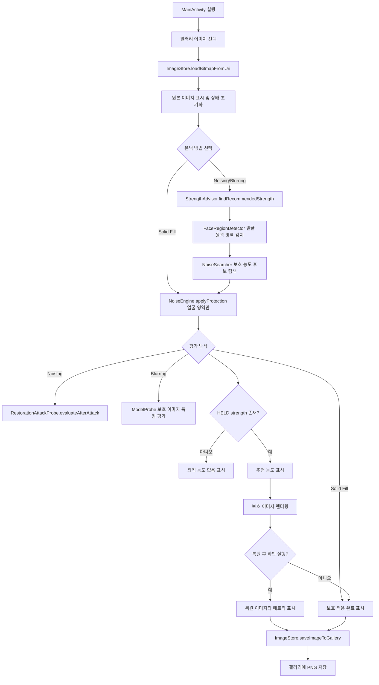
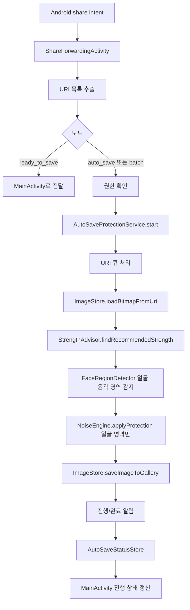

# 실행 흐름

## 이번 문서의 학습 목표

수동 보호와 공유 시트 자동 저장이 어떤 순서로 실행되는지 따라간다.

## 앞 문서와의 연결

이 문서는 [02-architecture.md](02-architecture.md)에서 이어진다. 순서대로 읽으면 이전 문서에서 잡은 맥락을 바탕으로 이번 문서의 세부 내용을 이해할 수 있다.

## 4. 전체 실행 흐름

### 메인 화면 수동 흐름

1. 사용자가 [`MainActivity`](../app/src/main/java/com/haanghil/muulnaat/MainActivity.kt)를 실행한다.
2. `ActivityResultContracts.PickVisualMedia`로 이미지를 선택한다.
3. [`ImageStore.loadBitmapFromUri()`](../app/src/main/java/com/haanghil/muulnaat/ImageStoreLoad.kt)가 URI에서 비트맵을 읽고, 큰 이미지는 최대 변 기준 1280px 근처로 downsample하며, EXIF 방향을 보정한다.
4. [`prepareLoadedImage()`](../app/src/main/java/com/haanghil/muulnaat/MainActivityImageFlow.kt)가 원본 이미지를 화면에 표시하고 이전 결과를 초기화한다.
5. [`startOptimalStrengthFlow()`](../app/src/main/java/com/haanghil/muulnaat/MainActivityImageFlow.kt)가 백그라운드 thread에서 [`StrengthAdvisor.findRecommendedStrength()`](../app/src/main/java/com/haanghil/muulnaat/StrengthAdvisor.kt)를 호출한다.
6. [`FaceRegionDetector.detectRegions()`](../app/src/main/java/com/haanghil/muulnaat/FaceRegionDetector.kt)가 원본에서 얼굴 bbox와 가능한 얼굴 외곽 contour를 찾는다.
7. [`NoiseSearcher.findMinimumStrength()`](../app/src/main/java/com/haanghil/muulnaat/NoiseSearcher.kt)가 보호 농도 후보를 검사한다.
8. 각 후보마다 [`NoiseEngine.applyProtection()`](../app/src/main/java/com/haanghil/muulnaat/NoiseEngine.kt)으로 얼굴 contour 또는 타원 근사 마스크 안에만 보호 이미지를 만들고 [`RestorationAttackProbe.evaluateAfterAttack()`](../app/src/main/java/com/haanghil/muulnaat/RestorationAttackProbe.kt)으로 denoising + 2x upscaling 후 얼굴 특징 억제를 평가한다.
9. 최소 [`HELD`](../app/src/main/java/com/haanghil/muulnaat/PipelineContracts.kt) 보호 농도가 있으면 UI에 추천값을 표시하고, auto recovery 설정에 따라 보호 적용과 평가를 이어서 실행한다.
10. 사용자가 저장 버튼을 누르면 [`ImageStore.saveImageToGallery()`](../app/src/main/java/com/haanghil/muulnaat/ImageStoreSave.kt)가 PNG를 MediaStore에 저장한다.

### 공유 시트 자동 저장 흐름

1. 다른 앱에서 이미지를 공유하면 [`ShareReadyToSaveActivity`](../app/src/main/java/com/haanghil/muulnaat/ShareEntrypoints.kt) 또는 방법별 자동 저장 entrypoint인 `ShareAutoSaveNoiseActivity`, `ShareAutoSaveBlurActivity`, `ShareAutoSaveSolidFillActivity`가 받는다.
2. [`ShareForwardingActivity`](../app/src/main/java/com/haanghil/muulnaat/ShareForwardingActivity.kt)가 [`sharedImageUris()`](../app/src/main/java/com/haanghil/muulnaat/ShareIntentUris.kt)로 URI 목록을 만든다.
3. 단일 ready-to-save는 [`MainActivity`](../app/src/main/java/com/haanghil/muulnaat/MainActivity.kt)로 넘긴다.
4. auto-save 또는 다중 이미지는 권한 확인 후 [`AutoSaveProtectionService.start()`](../app/src/main/java/com/haanghil/muulnaat/AutoSaveStart.kt)로 foreground service를 시작한다.
5. 서비스는 큐에 URI와 `HidingConfig`를 함께 넣고 worker thread에서 이미지별로 로드, 방법별 탐색 또는 즉시 적용, 저장을 반복한다.
6. 알림으로 진행 상황을 표시하고 cancel action을 처리한다.
7. 앱이 열려 있으면 [`AutoSaveStatusStore`](../app/src/main/java/com/haanghil/muulnaat/AutoSaveStatusStore.kt)가 같은 진행 문구를 [`MainActivity`](../app/src/main/java/com/haanghil/muulnaat/MainActivity.kt)에 실시간 전달한다.

## 이번 문서에서 반드시 이해해야 할 요점

- 이 문서의 설명은 현재 repo의 완성된 코드와 산출물 기준이다.
- 링크된 실제 파일을 함께 열어 보면 책임 분리와 실행 흐름을 더 정확히 확인할 수 있다.
- 코드가 바뀌면 이 문서의 설명도 함께 갱신해야 한다.

## 다음 문서

다음 문서: [04-core-components.md](04-core-components.md)

