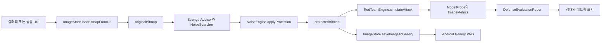
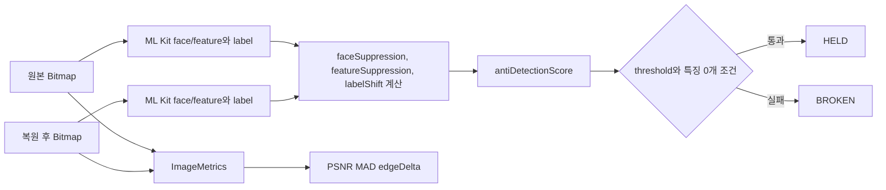
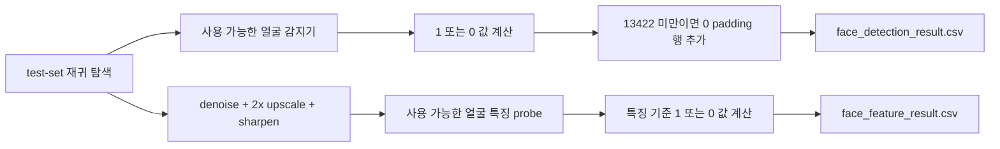
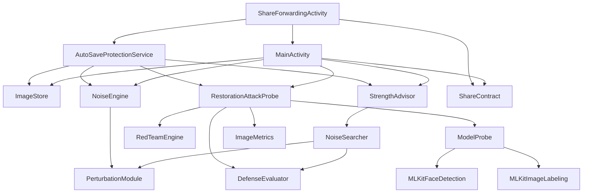

# 데이터 흐름

## 이번 문서의 학습 목표

비트맵, 평가 결과, CSV 실험 데이터가 어디서 생성되고 어떻게 이동하는지 이해한다.

## 앞 문서와의 연결

이 문서는 [04-core-components.md](04-core-components.md)에서 이어진다. 순서대로 읽으면 이전 문서에서 잡은 맥락을 바탕으로 이번 문서의 세부 내용을 이해할 수 있다.

## 6. 데이터 흐름

### 앱 내부 이미지 데이터 흐름

### 평가 데이터 흐름

### CSV 실험 스크립트 데이터 흐름

입력 디렉터리와 생성 CSV는 `.gitignore` 대상이지만, 현재 `face_detection_result.csv`의 헤더와 집계값은 로컬에서 확인했다. `face_feature_result.csv`는 새 얼굴 특징 실험 산출물이며 기존 CSV를 덮어쓰지 않는다.

## 7. 모듈 의존 관계

의존 관계의 핵심은 [`PipelineContracts.kt`](../app/src/main/java/com/haanghil/muulnaat/PipelineContracts.kt)가 모듈 간 인터페이스를 잡고, [`NoiseEngine`](../app/src/main/java/com/haanghil/muulnaat/NoiseEngine.kt)과 [`RestorationAttackProbe`](../app/src/main/java/com/haanghil/muulnaat/RestorationAttackProbe.kt)가 각각 [`PerturbationModule`](../app/src/main/java/com/haanghil/muulnaat/PipelineContracts.kt), [`DefenseEvaluator`](../app/src/main/java/com/haanghil/muulnaat/PipelineContracts.kt) 구현체로 들어간다는 점이다.

## 이번 문서에서 반드시 이해해야 할 요점

- 이 문서의 설명은 현재 repo의 완성된 코드와 산출물 기준이다.
- 링크된 실제 파일을 함께 열어 보면 책임 분리와 실행 흐름을 더 정확히 확인할 수 있다.
- 코드가 바뀌면 이 문서의 설명도 함께 갱신해야 한다.

## 다음 문서

다음 문서: [06-implementation-details.md](06-implementation-details.md)

